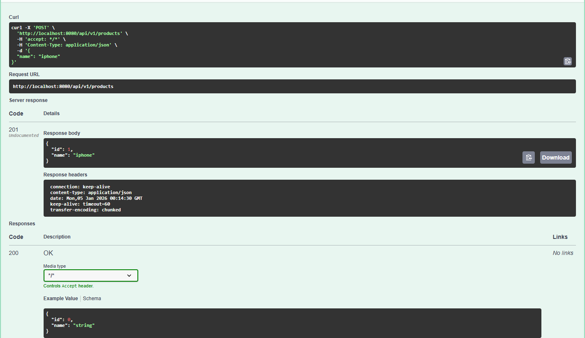
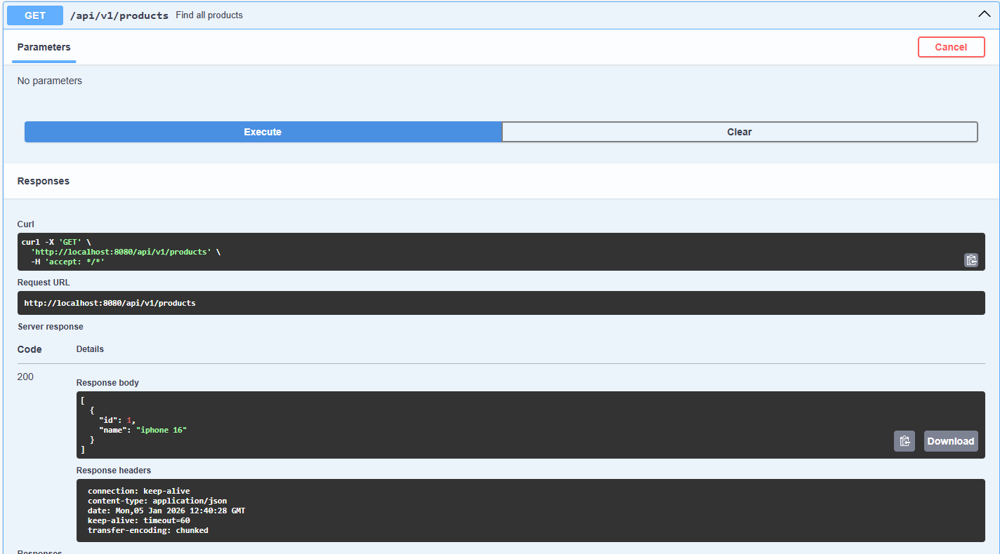
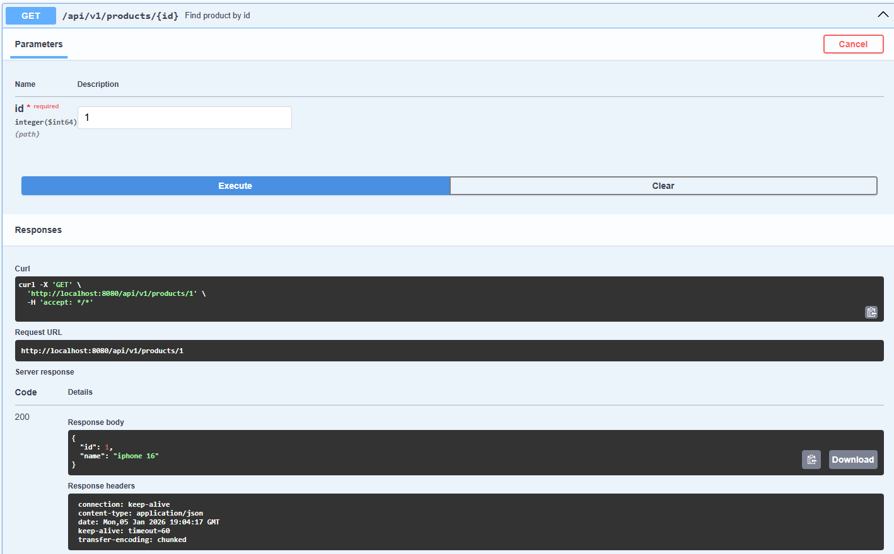
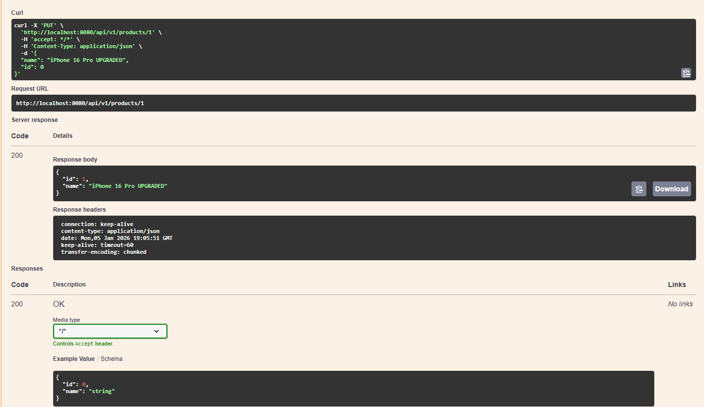
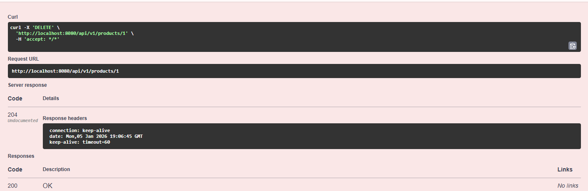

# Product API Project

This is a REST API application for product management built with Java Spring Boot.
It implements full CRUD functionality (Create, Read, Update, Delete).

## 🛠 Technologies
* **Java 21**
* **Spring Boot 3.4.1**
* **H2 Database** (in-memory database)
* **Swagger UI** (for documentation and testing)

## 📸 Functionalities & Database Activity

### 1. Main Documentation Page (Swagger)
Overview of all available endpoints:

### 2. Create Product (POST)
Creating a new entry in the database. Status **201 Created**:

### 3. Read All Products (GET)
Retrieving the list of all products from the database:

### 4. Read Single Product (GET by ID)
Fetching specific data using a unique identifier:

### 5. Update Product (PUT)
Modifying an existing entry (changing name). Status **200 OK**:

### 6. Delete Product (DELETE)
Removing an entry from the database. Status **204/200 OK**:

## 🚀 How to Run
1.  Open the project in **IntelliJ IDEA**.
2.  Run the `FirstRestApiSpringApplication` class.
3.  The server will start on port `8080`.
4.  Open your browser: [http://localhost:8080/swagger-ui/index.html](http://localhost:8080/swagger-ui/index.html)

## 🔌 API Endpoints
* `GET /api/v1/products` — **Read**: Get list of all products
* `GET /api/v1/products/{id}` — **Read**: Find product by ID
* `POST /api/v1/products` — **Create**: Add a new product
* `PUT /api/v1/products/{id}` — **Update**: Modify an existing product
* `DELETE /api/v1/products/{id}` — **Delete**: Remove a product

## ⚠️ Note
The application uses an **H2 In-Memory Database**. All data is reset when the application restarts.